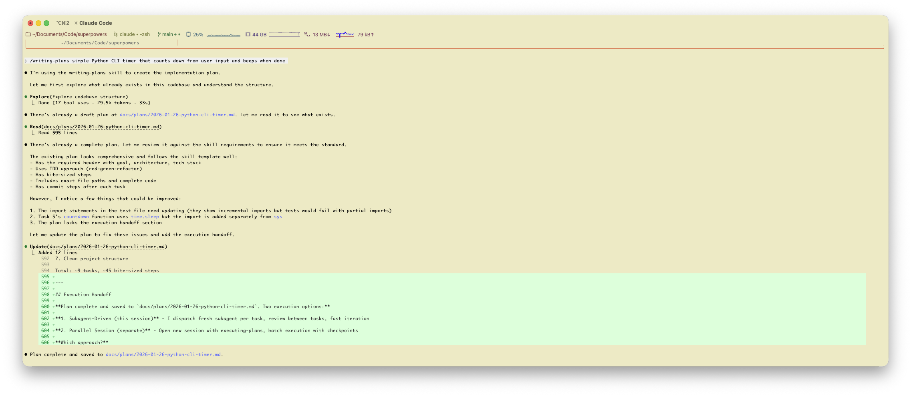
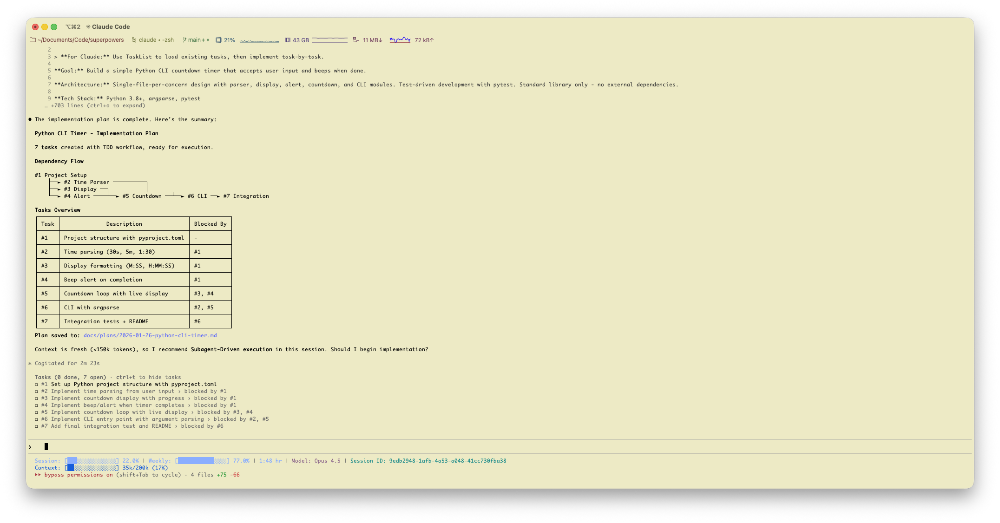

# Superpowers Extended for Claude Code

A community-maintained fork of [obra/superpowers](https://github.com/obra/superpowers) specifically for Claude Code users.

## Why This Fork Exists

The original Superpowers is designed as a cross-platform toolkit that works across multiple AI CLI tools (Claude Code, Codex, OpenCode, Gemini CLI). Features unique to Claude Code fall outside the scope of the upstream project due to its [cross-platform nature](https://github.com/obra/superpowers/pull/344#issuecomment-3795515617).

This fork integrates Claude Code-native features into the Superpowers workflow.

### What We Do Differently

- Leverage Claude Code-native features as they're released
- Community-driven - contributions welcome for any CC-specific enhancement
- Track upstream - stay compatible with obra/superpowers core workflow

### Current Enhancements

| Feature | Claude Code Version | Description |
|---------|---------------------|-------------|
| Native Task Management | v2.1.16+ | Dependency tracking, real-time progress visibility |

## Visual Comparison

<table>
<tr>
<th>Superpowers (Vanilla)</th>
<th>Superpowers Extended CC</th>
</tr>
<tr>
<td valign="top">



- Tasks exist only in markdown plan
- No runtime task visibility
- Agent may jump ahead or skip tasks
- Progress tracked manually by reading output

</td>
<td valign="top">



- **Dependency enforcement** - Task 2 blocked until Task 1 completes (no front-running)
- **Execution on rails** - Native task manager keeps agent following the plan
- **Real-time visibility** - User sees actual progress with pending/in_progress/completed states
- **Session-aware** - TaskList shows what's done, what's blocked, what's next

</td>
</tr>
</table>

## Installation

### Claude Code (via Plugin Marketplace)

In Claude Code, register the marketplace first:

```bash
/plugin marketplace add pcvelz/superpowers
```

Then install the plugin:

```bash
/plugin install superpowers-extended-cc@superpowers-extended-cc-marketplace
```

### Verify Installation

Check that commands appear:

```bash
/help
```

```
# Should see:
# /superpowers-extended-cc:brainstorming - Interactive design refinement
# /superpowers-extended-cc:writing-plans - Create implementation plan
# /superpowers-extended-cc:executing-plans - Execute plan in batches
```

## The Basic Workflow

1. **brainstorming** - Activates before writing code. Refines rough ideas through questions, explores alternatives, presents design in sections for validation. Saves design document.

2. **using-git-worktrees** - Activates after design approval. Creates isolated workspace on new branch, runs project setup, verifies clean test baseline.

3. **writing-plans** - Activates with approved design. Breaks work into bite-sized tasks (2-5 minutes each). Every task has exact file paths, complete code, verification steps. *Creates native tasks with dependencies.*

4. **subagent-driven-development** or **executing-plans** - Activates with plan. Dispatches fresh subagent per task with two-stage review (spec compliance, then code quality), or executes in batches with human checkpoints.

5. **test-driven-development** - Activates during implementation. Enforces RED-GREEN-REFACTOR: write failing test, watch it fail, write minimal code, watch it pass, commit. Deletes code written before tests.

6. **requesting-code-review** - Activates between tasks. Reviews against plan, reports issues by severity. Critical issues block progress.

7. **finishing-a-development-branch** - Activates when tasks complete. Verifies tests, presents options (merge/PR/keep/discard), cleans up worktree.

**The agent checks for relevant skills before any task.** Mandatory workflows, not suggestions.

## What's Inside

### Skills Library

**Testing**
- **test-driven-development** - RED-GREEN-REFACTOR cycle (includes testing anti-patterns reference)

**Debugging**
- **systematic-debugging** - 4-phase root cause process (includes root-cause-tracing, defense-in-depth, condition-based-waiting techniques)
- **verification-before-completion** - Ensure it's actually fixed

**Collaboration**
- **brainstorming** - Socratic design refinement + *native task creation*
- **writing-plans** - Detailed implementation plans + *native task dependencies*
- **executing-plans** - Batch execution with checkpoints
- **dispatching-parallel-agents** - Concurrent subagent workflows
- **requesting-code-review** - Pre-review checklist
- **receiving-code-review** - Responding to feedback
- **using-git-worktrees** - Parallel development branches
- **finishing-a-development-branch** - Merge/PR decision workflow
- **subagent-driven-development** - Fast iteration with two-stage review (spec compliance, then code quality)

**Meta**
- **writing-skills** - Create new skills following best practices (includes testing methodology)
- **using-superpowers** - Introduction to the skills system

## Philosophy

- **Test-Driven Development** - Write tests first, always
- **Systematic over ad-hoc** - Process over guessing
- **Complexity reduction** - Simplicity as primary goal
- **Evidence over claims** - Verify before declaring success

Read more: [Superpowers for Claude Code](https://blog.fsck.com/2025/10/09/superpowers/)

## Contributing

Contributions for Claude Code-specific enhancements are welcome!

1. Fork this repository
2. Create a branch for your enhancement
3. Follow the `writing-skills` skill for creating and testing new skills
4. Submit a PR

See `skills/writing-skills/SKILL.md` for the complete guide.

## Updating

Skills update automatically when you update the plugin:

```bash
/plugin update superpowers-extended-cc@superpowers-extended-cc-marketplace
```

## Upstream Compatibility

This fork tracks `obra/superpowers` main branch. Changes specific to Claude Code are additive - the core workflow remains compatible.

## License

MIT License - see LICENSE file for details

## Support

- **Issues**: https://github.com/pcvelz/superpowers/issues
- **Upstream**: https://github.com/obra/superpowers
