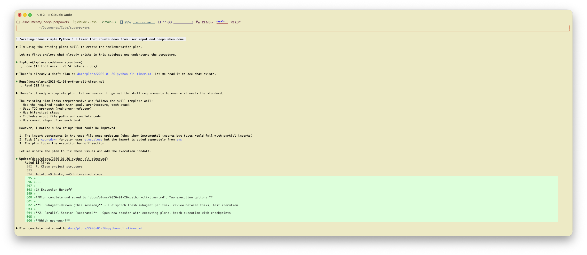
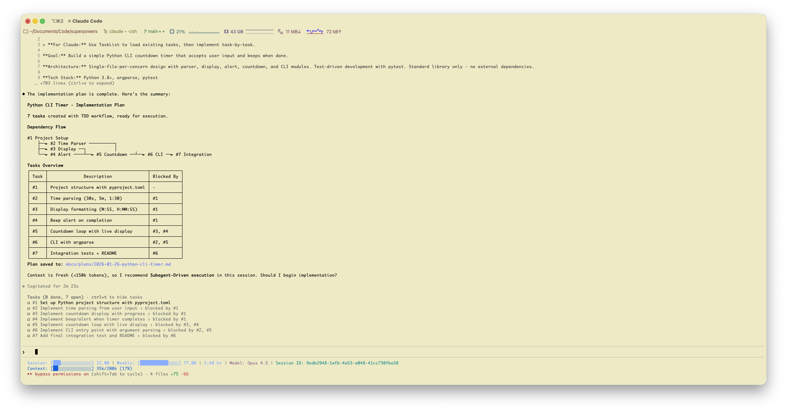

# Superpowers Extended for Claude Code

A community-maintained fork of [obra/superpowers](https://github.com/obra/superpowers) specifically for Claude Code users.

## Why This Fork Exists

The original Superpowers is designed as a cross-platform toolkit that works across multiple AI CLI tools (Claude Code, Codex, OpenCode, Gemini CLI). Features unique to Claude Code fall outside the scope of the upstream project due to its [cross-platform nature](https://github.com/obra/superpowers/pull/344#issuecomment-3795515617).

This fork integrates Claude Code-native features into the Superpowers workflow.

### What We Do Differently

- Leverage Claude Code-native features as they're released
- Community-driven - contributions welcome for any CC-specific enhancement
- Track upstream - stay compatible with obra/superpowers core workflow

### Current Enhancements

| Feature | Claude Code Version | Description |
|---------|---------------------|-------------|
| Native Task Management | v2.1.16+ | Dependency tracking, real-time progress visibility |
| Structured Task Metadata | v2.1.16+ | Goal/Files/AC/Verify structure with embedded `json:metadata` |
| Pre-commit Task Gate | v2.1.16+ | Plugin hook blocks `git commit` when tasks are incomplete |
| User-Thrown Gate Enforcement | v2.1.16+ | `userGate` / `user-gate` tag + opt-in hooks force re-validation when Claude closes a user-ordered verification task (see "Recommended Configuration") |

## Visual Comparison

<table>
<tr>
<th>Superpowers (Vanilla)</th>
<th>Superpowers Extended CC</th>
</tr>
<tr>
<td valign="top">



- Tasks exist only in markdown plan
- No runtime task visibility
- Agent may jump ahead or skip tasks
- Progress tracked manually by reading output

</td>
<td valign="top">



- **Dependency enforcement** - Task 2 blocked until Task 1 completes (no front-running)
- **Execution on rails** - Native task manager keeps agent following the plan
- **Real-time visibility** - User sees actual progress with pending/in_progress/completed states
- **Session-aware** - TaskList shows what's done, what's blocked, what's next

</td>
</tr>
</table>

## Installation

### Option 1: Via Marketplace (recommended)

```bash
# Register marketplace
/plugin marketplace add pcvelz/superpowers

# Install plugin
/plugin install superpowers-extended-cc@superpowers-extended-cc-marketplace
```

### Option 2: Direct URL

```bash
/plugin install --source url https://github.com/pcvelz/superpowers.git
```

### Verify Installation

Check that commands appear:

```bash
/help
```

```
# Should see:
# /superpowers-extended-cc:brainstorming - Interactive design refinement
# /superpowers-extended-cc:writing-plans - Create implementation plan
# /superpowers-extended-cc:executing-plans - Execute plan in batches
```

## The Basic Workflow

1. **brainstorming** - Activates before writing code. Refines rough ideas through questions, explores alternatives, presents design in sections for validation. Saves design document.

2. **using-git-worktrees** - Activates after design approval. Enters isolated workspace via `EnterWorktree`, runs project setup, verifies clean test baseline.

3. **writing-plans** - Activates with approved design. Breaks work into bite-sized tasks (2-5 minutes each). Every task has exact file paths, complete code, verification steps. *Creates native tasks with dependencies.*

4. **subagent-driven-development** or **executing-plans** - Activates with plan. Dispatches fresh subagent per task with two-stage review (spec compliance, then code quality), or executes in batches with human checkpoints.

5. **test-driven-development** - Activates during implementation. Enforces RED-GREEN-REFACTOR: write failing test, watch it fail, write minimal code, watch it pass, commit. Deletes code written before tests.

6. **requesting-code-review** - Activates between tasks. Reviews against plan, reports issues by severity. Critical issues block progress.

7. **finishing-a-development-branch** - Activates when tasks complete. Verifies tests, presents options (merge/PR/keep/discard), cleans up worktree.

**The agent checks for relevant skills before any task.** Mandatory workflows, not suggestions.

## How Native Tasks Work

When `writing-plans` creates tasks, each task carries structured metadata that survives across sessions and subagent dispatch:

```yaml
TaskCreate:
  subject: "Task 1: Add price validation to optimizer"
  description: |
    **Goal:** Validate input prices before optimization runs.

    **Files:**
    - Modify: `src/optimizer.py:45-60`
    - Create: `tests/test_price_validation.py`

    **Acceptance Criteria:**
    - [ ] Negative prices raise ValueError
    - [ ] Empty price list raises ValueError
    - [ ] Valid prices pass through unchanged

    **Verify:** `pytest tests/test_price_validation.py -v`

    ```json:metadata
    {"files": ["src/optimizer.py", "tests/test_price_validation.py"],
     "verifyCommand": "pytest tests/test_price_validation.py -v",
     "acceptanceCriteria": ["Negative prices raise ValueError",
       "Empty price list raises ValueError",
       "Valid prices pass through unchanged"]}
    ```
```

The `json:metadata` block is embedded in the description because `TaskGet` returns the description but not the `metadata` parameter. This ensures metadata is always available — for `executing-plans` verification, `subagent-driven-development` dispatch, and `.tasks.json` cross-session resume.

## User-Thrown Gate Enforcement — Optional Flow

*Canonical design doc: [`docs/user-gate-flow.md`](docs/user-gate-flow.md). The section below is a reader-facing summary.*

This flow addresses a recurring failure: the user says "add a gate" or "verify it works" without specifying **how**, the agent invents a verification method, then finds it expensive at execution time and walks around it — closing the gate with an inline shortcut. The fix is a three-layer architecture that *never bothers the user during planning* and only surfaces a forced question when the agent genuinely can't proceed without one.

**The whole flow is opt-in.** It activates only when you register the hooks below in `.claude/settings.local.json`. The slash command sits dormant without the hook — installing it alone does nothing.

### Design principle — don't bombard the user during planning

Users who want questions will say "brainstorm". Users who ask for a gate during planning just want the work done, they don't want a four-question interrogation. So `writing-plans` is silent here: it applies the **stricter definition** of a gate and tags liberally. Better to over-tag and let the execution-time hook filter than to over-question the user mid-plan.

### The three layers

| Layer | When | What it does |
|-------|------|--------------|
| **Write-plan (silent tagging)** | Plan authoring | Detects gate-language in the brief ("verify", "prove", "gate", "first on one then all", "make sure", "don't proceed until"). Tags the resulting task with `userGate: true` + `tags: ["user-gate"]`. No user questions. Uses the stricter definition: strict user gates AND strict agent gates AND gray-in-between all get tagged. |
| **Execute-plan (hard trigger via hook)** | Task close / stop | The PostToolUse + Stop hooks fire when a tagged task is closed. The agent must then assess each criterion and choose one of two paths (below). |
| **`/specify-gate` slash command (dormant unless hook active)** | Execute-plan, only when the agent cannot proceed | Asked 3-4 structured questions to the user that lock down the HOW: observable outcome, proof mechanism, scope, failure policy. Produces a structured verify spec the agent consumes. |

### Agent decision at execute time

When a tagged task comes up, the agent asks itself: **do I know *how* to verify this?**

- **"Verify the `/health` endpoint returns 200"** → the HOW is self-evident. Agent just hits the endpoint, captures the output, posts `AC: <criterion> — PROVEN BY <evidence>`. No slash command needed. The hook sees the proof and passes.
- **"Check it works"** → the HOW is vague. Agent invokes `/specify-gate`, which asks the user the 3-4 minimal questions, then uses the answers to execute real verification. No silent invention, no inline shortcut.
- **Write-plan explicitly flagged `requiresUserSpecification: true`** → same path: invoke `/specify-gate`, ask the user.

The user is only interrupted at execute time, and only when the alternative is the agent making something up.

### Activation

Register both hooks in `.claude/settings.local.json` (see "Recommended Configuration" below for the exact JSON). Without them:
- `writing-plans` still tags gates (harmless extra metadata).
- `/specify-gate` still exists but is never triggered automatically.
- Nothing enforces evidence at close — behavior is identical to vanilla.

Install one hook or both. The PostToolUse hook catches per-task closures; the Stop hook catches end-of-plan "everything done" claims. They compose — both firing on the same session is fine.

### Escape hatches

Both hooks fail-open on errors and have env-var kill switches (`SUPERPOWERS_USERGATE_GUARD=0`, `SUPERPOWERS_USERGATE_STOP_GUARD=0`) for one-off session bypasses without editing settings.

---

## What's Inside

### Skills Library

**Testing**
- **test-driven-development** - RED-GREEN-REFACTOR cycle (includes testing anti-patterns reference)

**Debugging**
- **systematic-debugging** - 4-phase root cause process (includes root-cause-tracing, defense-in-depth, condition-based-waiting techniques)
- **verification-before-completion** - Ensure it's actually fixed

**Collaboration**
- **brainstorming** - Socratic design refinement + *native task creation*
- **writing-plans** - Detailed implementation plans + *native task dependencies*
- **executing-plans** - Batch execution with checkpoints
- **dispatching-parallel-agents** - Concurrent subagent workflows
- **requesting-code-review** - Pre-review checklist
- **receiving-code-review** - Responding to feedback
- **using-git-worktrees** - Parallel development branches
- **finishing-a-development-branch** - Merge/PR decision workflow
- **subagent-driven-development** - Fast iteration with two-stage review (spec compliance, then code quality)

**User-Thrown Gates** (optional flow, see "User-Thrown Gate Enforcement" above)
- **checking-gates** - Do-I-know-HOW self-check for user-gate tasks; runs verify + posts `AC:…PROVEN BY` evidence, or hands off to specifying-gates
- **specifying-gates** - Interactive 4-question AskUserQuestion flow that locks down the HOW for a vague user-gate

**Meta**
- **writing-skills** - Create new skills following best practices (includes testing methodology)
- **using-superpowers** - Introduction to the skills system

## Philosophy

- **Test-Driven Development** - Write tests first, always
- **Systematic over ad-hoc** - Process over guessing
- **Complexity reduction** - Simplicity as primary goal
- **Evidence over claims** - Verify before declaring success

Read more: [Superpowers for Claude Code](https://blog.fsck.com/2025/10/09/superpowers/)

## Contributing

Contributions for Claude Code-specific enhancements are welcome!

1. Fork this repository
2. Create a branch for your enhancement
3. Follow the `writing-skills` skill for creating and testing new skills
4. Submit a PR

See `skills/writing-skills/SKILL.md` for the complete guide.

## Recommended Configuration

### Disable Auto Plan Mode

Claude Code may automatically enter Plan mode during planning tasks, which conflicts with the structured skill workflows in this plugin. To prevent this, add `EnterPlanMode` to your permission deny list.

**In your project's `.claude/settings.json`:**

```json
{
  "permissions": {
    "deny": ["EnterPlanMode"]
  }
}
```

This blocks the model from calling `EnterPlanMode`, ensuring the brainstorming and writing-plans skills operate correctly in normal mode. See [upstream discussion](https://github.com/anthropics/claude-code/issues/23384) for context.

### Block Commits With Incomplete Tasks

Optional `PreToolUse` hook that blocks `git commit` while a native task is `in_progress`. Pending tasks pass through, so per-task commit flows work as intended.

Opt in via `.claude/settings.local.json`:

```json
{
  "hooks": {
    "PreToolUse": [
      {
        "matcher": "Bash",
        "hooks": [
          {
            "type": "command",
            "command": "bash ~/.claude/plugins/marketplaces/superpowers-extended-cc-marketplace/hooks/examples/pre-commit-check-tasks.sh"
          }
        ]
      }
    ]
  }
}
```

See the header of `hooks/examples/pre-commit-check-tasks.sh` for how it parses the session transcript and which task states count as open.

### Force Re-Validation on User-Thrown Gate Close

Optional `PostToolUse` hook that blocks when Claude closes a **user-thrown gate** task without capturing concrete evidence for every acceptance criterion. A user-thrown gate is any task that carries `"userGate": true` or a `"user-gate"` entry in `tags` inside its `json:metadata` fence — set by `writing-plans` when the user explicitly asked for a verification step ("make sure to verify X", "add a gate", "prove it on one, then all").

Non-gate tasks pass through silently. The hook only fires when `TaskUpdate` sets status to `completed`.

Opt in via `.claude/settings.local.json`:

```json
{
  "hooks": {
    "PostToolUse": [
      {
        "matcher": "TaskUpdate",
        "hooks": [
          {
            "type": "command",
            "command": "bash ~/.claude/plugins/marketplaces/superpowers-extended-cc-marketplace/hooks/examples/post-task-complete-revalidate.sh"
          }
        ]
      }
    ]
  }
}
```

See the header of `hooks/examples/post-task-complete-revalidate.sh` for how it parses `json:metadata` and the `USER-ORDERED GATE` banner, and how the `SUPERPOWERS_USERGATE_GUARD=0` escape hatch works.

### Re-Validate Gates on "Plan Complete" Claims

Optional `Stop` hook that complements the PostToolUse hook above. It fires when Claude signals plan completion ("plan complete", "both gates passed", "implementation complete", etc.) but the transcript shows user-thrown gate tasks were closed without subsequent per-criterion proof. Requires Claude to post evidence in the form `AC: <criterion> — PROVEN BY <evidence>` before it can stop.

Opt in via `.claude/settings.local.json`:

```json
{
  "hooks": {
    "Stop": [
      {
        "matcher": "",
        "hooks": [
          {
            "type": "command",
            "command": "bash ~/.claude/plugins/marketplaces/superpowers-extended-cc-marketplace/hooks/examples/stop-revalidate-user-gates.sh"
          }
        ]
      }
    ]
  }
}
```

See the header of `hooks/examples/stop-revalidate-user-gates.sh` for the full list of completion keywords and the `SUPERPOWERS_USERGATE_STOP_GUARD=0` escape hatch.

### Block Low-Context Stop Excuses

Optional `Stop`-event hook that blocks "fresh session later" / "context is full" deflections when real context usage is below 50%.

Opt in via `.claude/settings.local.json`:

```json
{
  "hooks": {
    "Stop": [
      {
        "matcher": "",
        "hooks": [
          {
            "type": "command",
            "command": "bash ~/.claude/plugins/marketplaces/superpowers-extended-cc-marketplace/hooks/examples/stop-deflection-guard.sh"
          }
        ]
      }
    ]
  }
}
```

See the header of `hooks/examples/stop-deflection-guard.sh` for the full list of blocked phrases, configuration environment variables, and fail-open behavior.

## Updating

Skills update automatically when you update the plugin:

```bash
/plugin update superpowers-extended-cc@superpowers-extended-cc-marketplace
```

## Upstream Compatibility

This fork tracks `obra/superpowers` main branch. Changes specific to Claude Code are additive - the core workflow remains compatible.

## License

MIT License - see LICENSE file for details

## Support

- **Issues**: https://github.com/pcvelz/superpowers/issues
- **Upstream**: https://github.com/obra/superpowers
